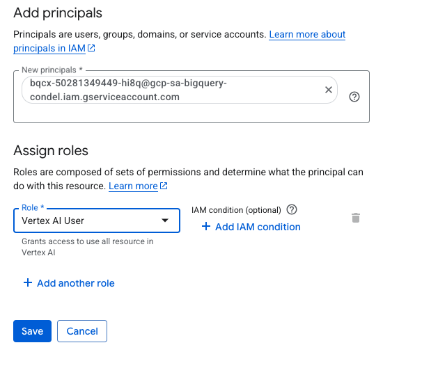
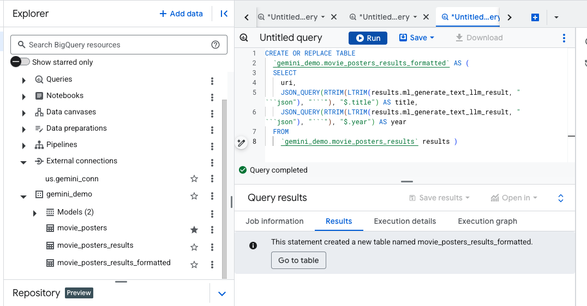

# GCP-LAB-Analyzing-Movie-Posters-in-BigQuery-with-Remote-Models
Analyzing Movie Posters in BigQuery with Remote Models

##### Overview
In this lab, you learn how to use BigQuery Machine Learning for inference with remote models (Gemini AI models) to analyze movie poster images and generate summaries of these posters as part of a Proof of Concept project.

BigQuery is a fully managed, AI-ready data analytics platform that helps you maximize value from your data and is designed to be multi-engine, multi-format, and multi-cloud. One of its key features is BigQuery Machine Learning for inference, which lets you create and run machine learning (ML) models by using GoogleSQL queries.

Gemini is a family of generative AI models developed by Google DeepMind that is designed for multimodal use cases. The Gemini API gives you access to the Gemini Pro Vision and Gemini Pro models.

###### Running ML models using GoogleSQL Queries
Usually, performing ML or artificial intelligence (AI) on large datasets requires extensive programming and knowledge of ML frameworks. These requirements restrict solution development to a very small set of people within each company, and they exclude data analysts who understand the data but have limited ML knowledge and programming expertise. However, with BigQuery Machine Learning for inference, SQL practitioners can use existing SQL tools and skills to build models, and generate results from LLMs and Cloud AI APIs.

##### Objectives

In this lab, you learn how to:

. Configure your environment and account to use APIs.
. Create a Cloud Resource connection in BigQuery.
. Create a dataset and object table in BigQuery for movie poster images.
. Create the Gemini remote models in BigQuery.
. Prompt Gemini to provide movie summaries for each poster.
. Generate text embeddings for the movie represented in each poster.
. Use BigQuery VECTOR_SEARCH to match movie poster images with closely related movies in the dataset.


### Task 1. Configure your environment and project to use APIs

In this task, you configure the lab environment, so that you can use the Cloud AI Companion API for Gemini and the Vertex AI Platform API with your project.

>Note:If you are unfamiliar with Cloud Shell, refer to Use Cloud Shell.

1. Sign in to the Google Cloud console with your lab credentials, and open the Cloud Shell terminal window.

2. To set your project ID and region environment variables, in Cloud Shell, run the following commands:

```
PROJECT_ID=$(gcloud config get-value project)
REGION=us-east4
echo "PROJECT_ID=${PROJECT_ID}"
echo "REGION=${REGION}"
```
3. To store the signed-in Google user account in an environment variable, run the following command:

```
USER=$(gcloud config get-value account 2> /dev/null)
echo "USER=${USER}"
```

4. Enable the Cloud AI Companion API for Gemini and Vertex AI API:

```
gcloud services enable cloudaicompanion.googleapis.com --project ${PROJECT_ID}
gcloud services enable aiplatform.googleapis.com --project ${PROJECT_ID}
```

5. To use Gemini, grant the necessary IAM roles to your Google Cloud Qwiklabs user account:

```
gcloud projects add-iam-policy-binding ${PROJECT_ID} --member user:${USER} --role=roles/cloudaicompanion.user
gcloud projects add-iam-policy-binding ${PROJECT_ID} --member user:${USER} --role=roles/serviceusage.serviceUsageViewer
```


### Task 2. Create a Cloud Resource connection

In this task you create a Cloud Resource connection in BigQuery so that you can work with Gemini Pro and Gemini Pro Vision models.

1. In the Google Cloud Console, on the Navigation menu, click BigQuery.

2. Click DONE on the Welcome pop-up.

3. To create a connection, click + ADD, and then click Connections to external data sources.

>Note: Alternatively, if you do not see the option for + Add followed by Connections to external data sources, you can click + Add data, and then use the search bar for data sources to search for Vertex AI. Click on the result for Vertex AI.

1. In the Connection type list, select Vertex AI remote models, remote functions and BigLake (Cloud Resource).

2. In the Connection ID field, enter gemini_conn for your connection.

3. For Location type, select Multi-region and then, from dropdown select US multi-region.

4. Use the defaults for the other settings.

5. Click Create connection.

6. Click GO TO CONNECTION.

7. In the Connection info pane, copy the service account ID to a text file for use in the next task. You will also see that the connection is added under the External Connections section of your project in the BigQuery Explorer.


### Task 3. Grant IAM permissions to the connection's service account
In this task, you grant the Cloud Resource connection's service account IAM permissions, through a role, to enable it access the Vertex AI services.

1. In the Google Cloud console, on the Navigation menu, click IAM & Admin.

2. Click Grant Access.

3. In the New principals field, enter the service account ID that you copied earlier.

4. In the Select a role field, enter Vertex AI, and then select Vertex AI User role.

5. Click Save.

The result is the service account ID now includes the Vertex AI User role.




### Task 4. Create the dataset and object table in BigQuery for movie poster images

In this task, you create a dataset for the project and an object table within it to store the poster images.

Create a dataset
1. In the Google Cloud console, select the Navigation menu (Navigation menu icon), and then select BigQuery.

2. In the Explorer panel, for qwiklabs-gcp-02-78900ee6129b, select View actions (More menu icon), and then select Create dataset.

You create a dataset to store database objects, including tables and models.

3. In the Create dataset pane, enter the following information:

| Field	| Value |
| Dataset ID	| gemini_demo |
| Location type	| select Multi-region |
| Multi-region	| select US |

Leave the other fields at their defaults.

4. Click Create Dataset.

The result is the gemini_demo dataset is created and listed underneath your project in the BigQuery Explorer.

##### Create the object table

To create the object table you will use a SQL query.

1. Click the + to Create new SQL query.

2. In the query editor, paste the query below.

```
CREATE OR REPLACE EXTERNAL TABLE
  `gemini_demo.movie_posters`
WITH CONNECTION `us.gemini_conn`
OPTIONS (
  object_metadata = 'SIMPLE',
  uris = ['gs://cloud-samples-data/vertex-ai/dataset-management/datasets/classic-movie-posters/*']
  );
```


3. Run the query.

The result is movie_posters object table is added to the gemini_demo dataset and loaded with the URI (the Cloud Storage location) of each movie poster image.

4. In the Explorer, click on the movie_posters and review the schema and details. Feel free to query the table to review specific records.


### Task 5. Create the Gemini remote models in BigQuery

Now that the object table is created, you can begin to work with it. In this task, you create remote models for Gemini Pro and Gemini Pro Vision models in BigQuery.

1. Create the Gemini Pro model
2. Click the + to create a new SQL query.

In the query editor, paste the query below and run it.

```
CREATE OR REPLACE MODEL `gemini_demo.gemini_pro`
REMOTE WITH CONNECTION `us.gemini_conn`
OPTIONS (endpoint = 'gemini-2.0-flash-001')
```

The result is the gemini_pro model is created and you see it added to the gemini_demo dataset, in the models section.

3. In the Explorer, click on the gemini_pro model and review the details and schema.


#### Create the Gemini Pro Vision model

1. Click the + to Create a new SQL Query.

2. In the query editor, paste the query below and run it.

```
CREATE OR REPLACE MODEL `gemini_demo.gemini_pro_vision`
REMOTE WITH CONNECTION `us.gemini_conn`
OPTIONS (endpoint = 'gemini-2.0-flash-001')
```
The result is the gemini_pro_vision model is created and you see it added to the gemini_demo dataset, in the models section.

3. In the Explorer, click on the gemini_pro_vision model and review the details and schema.


### Task 6. Prompt Gemini to provide movie summaries for each poster

In this task, you will use Gemini (the Gemini Pro and Vision models you just created) to analyze the movie poster images and generate summaries for each movie.


#### Analyze the images with Gemini Pro Vision model

1. Click the + to create a new SQL query.

2. In the query editor, paste the query below, and run it.

```
CREATE OR REPLACE TABLE
`gemini_demo.movie_posters_results` AS (
SELECT
    uri,
    ml_generate_text_llm_result
FROM
    ML.GENERATE_TEXT( MODEL `gemini_demo.gemini_pro_vision`,
    TABLE `gemini_demo.movie_posters`,
    STRUCT( 0.2 AS temperature,
        'For the movie represented by this poster, what is the movie title and year of release? Answer in JSON format with two keys: title, year. title should be string, year should be integer.' AS PROMPT,
        TRUE AS FLATTEN_JSON_OUTPUT)));
```


The result is the movie_posters_results table is created.

4. Click the + to create a new SQL query.

5. In the query editor, paste and run the query below.

```
SELECT * FROM `gemini_demo.movie_posters_results`
```


The result is rows for each movie poster with the URI (the Cloud Storage location of the movie poster image) and a JSON result including the movie title and the year the movie was released from the Gemini Pro Vision model.

You can retrieve these results in a more human readable way, by using the next query.

6. Click the + to create a new SQL query.

7. In the query editor, paste and run the query below.

```
CREATE OR REPLACE TABLE
  `gemini_demo.movie_posters_results_formatted` AS (
  SELECT
    uri,
    JSON_QUERY(RTRIM(LTRIM(results.ml_generate_text_llm_result, " ```json"), "```"), "$.title") AS title,
    JSON_QUERY(RTRIM(LTRIM(results.ml_generate_text_llm_result, " ```json"), "```"), "$.year") AS year
  FROM
    `gemini_demo.movie_posters_results` results )
```

The result is the movie_posters_result_formatted table is created.




8. You can query the table with the query below, to see the rows created.

```
SELECT * FROM `gemini_demo.movie_posters_results_formatted`
```


Notice how the URI column results remain the same, but the JSON is now converted to the title and year columns for each row.


##### Prompt Gemini Pro to provide movie summaries

1. You can use Gemini Pro to provide movie summaries for each poster by running the query below.

```
SELECT
  uri,
  title,
  year,
  prompt,
  ml_generate_text_llm_result
  FROM
 ML.GENERATE_TEXT( MODEL `gemini_demo.gemini_pro`,
   (
   SELECT
     CONCAT('Provide a short summary of movie titled ',title, ' from the year ',year,'.') AS prompt,
     uri,
     title,
     year
   FROM
     `gemini_demo.movie_posters_results_formatted`
   LIMIT
     20 ),
   STRUCT(0.2 AS temperature,
     TRUE AS FLATTEN_JSON_OUTPUT));     
```


Notice how the result is similar to the previous query, but now the prompt used with Gemini is displayed in the prompt column and the result of using this prompt is included in the ml_generate_text_llm_result field; this includes a short summary of the movie.

### Task 7. Generate text embeddings using a remote model

In this task, you will generate text embeddings using a remote model so that you can perform further analysis.

##### Create the remote model
To generate the text embeddings, you will need to use the remote text-multilingual-embedding-002 model hosted on the endpoint and then you can generate the embeddings.

1. Click the + to create a new SQL query.

2. In the query editor, paste and run the query below.

```
CREATE OR REPLACE MODEL `gemini_demo.text_embedding`
REMOTE WITH CONNECTION `us.gemini_conn`
OPTIONS (endpoint = 'text-multilingual-embedding-002')
```

The result is the text_embedding model is created and appears in the explorer underneath the gemini_demo dataset.


##### Generate text embeddings for the title and year associated with the posters
You will need to create a table to store the results.

1. Click the + to create a new SQL query.

2. In the query editor, paste and run the query below.

```
CREATE OR REPLACE TABLE
  `gemini_demo.movie_posters_results_embeddings` AS (
  SELECT
    *
  FROM
    ML.GENERATE_EMBEDDING(
    MODEL `gemini_demo.text_embedding`,
    (
    SELECT
      CONCAT('The movie titled ', title, ' from the year ', year,'.') AS content,
      title,
      year,
      uri
    FROM
      `gemini_demo.movie_posters_results_formatted` ),
    STRUCT(TRUE AS flatten_json_output)));
```

The result is the movie_poster_results_embeddings table is created containing the results of creating embeddings for the text content (uri, movie title and year released) from the gemini_demo.movie_posters_results_formatted table.

>Note: The ML.GENERATE_EMBEDDING function is used to generate the embeddings. This function takes three arguments:
. The first argument is the name of the model to use for generating the embeddings. In this case, the model is called gemini_demo.text_embedding .
. The second argument is a subquery that selects the text content to be embedded. In this case, the subquery selects the title and year of each movie, and concatenates them into a single string.
. The third argument is a struct that specifies the output format of the embeddings. In this case, the flatten_json_output field is set to TRUE , which means that the embeddings will be flattened into a single JSON object.
.


3. You can view the results of the query using the new query below:

```
SELECT * FROM `gemini_demo.movie_posters_results_embeddings`
```


##### Generate text embeddings for a subset of the IMDB dataset

You will create a new view that contains only the movies in the dataset that were released prior to 1935.

1. Create and run a new query with the following SQL statement.

```
CREATE OR REPLACE VIEW
  `gemini_demo.imdb_movies` AS (
  WITH
    reviews AS (
      SELECT
        reviews.movie_id AS movie_id,
        title.primary_title AS title,
        title.start_year AS year,
        reviews.review AS review
      FROM
        `bigquery-public-data.imdb.reviews` reviews
      LEFT JOIN
        `bigquery-public-data.imdb.title_basics` title
      ON
        reviews.movie_id = title.tconst)
  SELECT
    DISTINCT(movie_id),
    title,
    year
  FROM
    reviews
  WHERE
    year < 1935)
```

The result is a new view containing a list of distinct movie IDs, titles, and year of release from the bigquery-public-data.imdb.reviews table for all movies in the dataset released before 1935.


2. Create and run a new query with the following SQL statement.

```
CREATE OR REPLACE TABLE
  `gemini_demo.imdb_movies_embeddings` AS (
  SELECT
    *
  FROM
    ML.GENERATE_EMBEDDING( MODEL `gemini_demo.text_embedding`,
      (
      SELECT
        CONCAT('The movie titled ', title, ' from the year ', year,'.') AS content,
        title,
        year,
        movie_id
      FROM
        `gemini_demo.imdb_movies` ),
      STRUCT(TRUE AS flatten_json_output) )
  WHERE
    ml_generate_embedding_status = '' );
```

The result of the query is a table that contains the embeddings for the text content of the gemini_demo.imdb_movies table.


##### Match the movie poster images to IMDB movie_id using BigQuery VECTOR_SEARCH

1. Create and run a new query with the following SQL statement.

```
SELECT
  query.uri AS poster_uri,
  query.title AS poster_title,
  query.year AS poster_year,
  base.title AS imdb_title,
  base.year AS imdb_year,
  base.movie_id AS imdb_movie_id,
  distance
FROM
 VECTOR_SEARCH( TABLE `gemini_demo.imdb_movies_embeddings`,
   'ml_generate_embedding_result',
   TABLE `gemini_demo.movie_posters_results_embeddings`,
   'ml_generate_embedding_result',
   top_k => 1,
   distance_type => 'COSINE');
   
   ```


The query uses the VECTOR_SEARCH function to find the nearest neighbor in the gemini_demo.imdb_movies_embeddings table for each row in the gemini_demo.movie_posters_results_embeddings table. The nearest neighbor is found using the cosine distance metric, which determines how similar two embeddings are.

This query can be used to find the most similar movie in the IMDB dataset for each of the movies identified by Gemini Pro Vision in the movie posters. For example, you could use this query to find the closest match for the movie "Au Secours!" (identified by Gemini Pro Vision in one of the movie posters) in the IMDB public dataset, which references this movie by its English-language title, "Help!".


2. Create and run a new query to join some additional information on movie ratings provided in the IMDB public dataset.

```
SELECT
  query.uri AS poster_uri,
  query.title AS poster_title,
  query.year AS poster_year,
  base.title AS imdb_title,
  base.year AS imdb_year,
  base.movie_id AS imdb_movie_id,
  distance,
  imdb.average_rating,
  imdb.num_votes
FROM
  VECTOR_SEARCH( TABLE `gemini_demo.imdb_movies_embeddings`,
    'ml_generate_embedding_result',
    TABLE `gemini_demo.movie_posters_results_embeddings`,
    'ml_generate_embedding_result',
    top_k => 1,
    distance_type => 'COSINE') DATA
LEFT JOIN
  `bigquery-public-data.imdb.title_ratings` imdb
ON
  base.movie_id = imdb.tconst
ORDER BY
  imdb.average_rating DESC
```
This query is similar to the previous query. It still uses special numerical representations called vector embeddings to find similar movies to a given movie poster. However, it also joins the average rating and number of votes for each nearest neighbor movie from a separate table from the IMDB public dataset.


#### Congratulations!
You successfully created an object table for your poster images in BigQuery, created remote Gemini models, used the models to prompt Gemini to analyze images and provided movie summaries, generated text embeddings for movie titles, and used embeddings to match movie poster images to the related movie title in the IMDB dataset.

